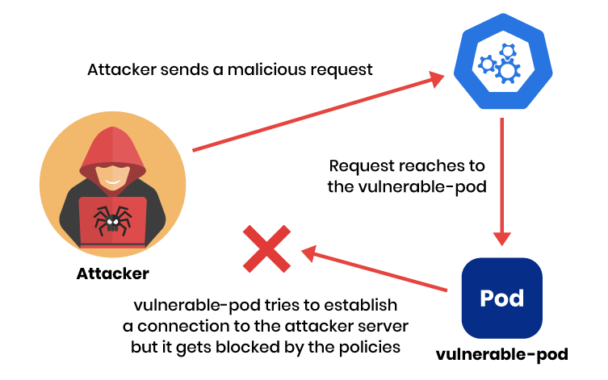

[Blogpost](https://www.tigera.io/blog/how-network-policies-can-protect-your-environment-from-future-vulnerabilities-like-log4j/)

# Preventing the Log4j zero-day vulnerability using a simple network policy

If you have access to the internet, it’s likely that you have already heard of the critical vulnerability in the Log4j library. A zero-day vulnerability in the Java library log4j, with the assigned CVE code of [CVE-2021-44228](https://nvd.nist.gov/vuln/detail/CVE-2021-44228), has been disclosed by Chen Zhaojun, a security researcher in the Alibaba Cloud Security team. It’s got people worried—and with good reason.

This is a serious flaw that needs to be addressed right away, since it can result in remote code execution (RCE) in many cases. By now, I have seen many creative ways in which this can be used to infiltrate or disturb services. The right solution is to identify and patch your vulnerable Log4j installations to the fixed versions as soon as possible. If you are using Log4j, make sure you are following [this page](https://logging.apache.org/log4j/2.x/security.html) where you can find the latest news about the vulnerability.

What else should you be doing, though, for this and similar exploits? In this blog post, I’ll look at the impact of the vulnerability in a Kubernetes cluster, and share a couple of ways that you can prevent such vulnerabilities in the future. 


Let’s start by acknowledging that the correct strategy is defense-in-depth. An appropriate CNI choice can definitely provide protection, but software should always be kept secure and up-to-date as well.

With that said, a zero-trust environment could have limited the scope of this attack or in some cases prevented it from happening, by isolating pods.

> <span style="color:yellow">**Note:**</span> This tutorial is based on kind, a CNCF verified Kubernetes installer that can spawn clusters very quickly inside Docker. All files and 

First create a local Kubernetes cluster by executing the following command:
```
kind create cluster --config https://raw.githubusercontent.com/frozenprocess/log4j-poc-demo/main/cluster.yml
```

Install `tigera-operator` and configure Calico.
```
kubectl create -f https://docs.projectcalico.org/manifests/tigera-operator.yaml
kubectl create -f https://docs.projectcalico.org/manifests/custom-resources.yaml
```
> <span style="color:yellow">**Note:**</span> The following manifest intentionally includes a vulnerable pod (CVE-2021-44228). Don’t run this in a production environment or any other environment exposed to untrusted networks.

Use the following manifest to install the vulnerable pod.
```
kubectl apply -f https://raw.githubusercontent.com/frozenprocess/log4j-poc-demo/main/vulnerable-demo.yml
```

> <span style="color:yellow">**Note:**</span> Make sure all pods are in a Running state before continuing (you can check the status of pods using the `kubectl get pods -A` command).

Before we dive into the exploitation, let's briefly explore the environment architecture and what is going to happen.

In order to simulate an external request, I’m going to use Docker to run a container outside of the cluster that was created in the previous steps. I will hook the container to the kind network that is used by the cluster.

When the exploit container is running, it will fire up the metasploit framework and try to establish a connection to the cluster. It will do this by using the values that are automatically determined via the `entry.sh` file located inside the `log4j-scanner` container.

> <span style="color:yellow">**Note:**</span> log4j-scanner is a simple container running the latest version of metasploit and using a log4shell scanner script to evaluate the existence of the vulnerability.

Run the exploit.
```
docker run --rm --name log4j-poc-exploit --net kind rezareza/log4j-scanner
```

You should see a similar output indicating a successful attack. The output should show the version of Java used inside the `vulnerable-pod`.
```
[*] Started service listener on 172.18.0.4:389
[*] Scanned 1 of 2 hosts (50% complete)
[+] 172.18.0.2:30950      - Log4Shell found via / (header: Authorization) (java: Oracle Corporation_11.0.13)
```

Basically, the attacker sent a malicious request by including `log4j` special lookup format inside the HTTP request headers. In this attempt, the attacker is looking for `${sys:java.vendor}` and `${sys:java.version}`, which will be substituted by log4j with the version of Java and the vendor providing it.
 
You can use the following command to check the actual request.
```
kubectl logs  deployments/vuln-pod -n log4j-demo  | egrep 'authorization'
```

When a request is received by the `vulnerable-pod` it establishes a connection to the attacker’s server and sends back information revealing the version of Java used inside the `vulnerable-pod`.

Here is the output taken from the `log4j-scanner`.
```
[+] 172.18.0.2:30950      - Log4Shell found via / (header: Authorization) (java: Oracle Corporation_11.0.13)
```


It is possible to manually verify which version of java `vulnerable-pod` is using by executing the following command:
```
kubectl exec -it  deployments/vuln-pod -n log4j-demo -- java --version
```

You should see a result similar to the below.
```
openjdk 11.0.13 2021-10-19
OpenJDK Runtime Environment 18.9 (build 11.0.13+8)
OpenJDK 64-Bit Server VM 18.9 (build 11.0.13+8, mixed mode, sharing)
```

As I’ve mentioned before, in a zero-trust environment, all resources are considered compromised and need to be put in isolation. This can easily be achieved by using a Calico `GlobalNetworkPolicy` since this type of policy affects the cluster as a whole.
```
apiVersion: projectcalico.org/v3
kind: GlobalNetworkPolicy
```

Just like any other Kubernetes resource, a `GlobalNetworkPolicy` can use all Kubernetes supported annotations to help maintain and manage this resource. 
```
metadata:
 name: deny-app-policy
```

The `types` attribute in the manifest defines which direction of traffic should be affected by this rule. In this example, let’s apply this rule to both ingress (inbound) and egress (outbound) traffic.
```
 types:
 - Ingress
 - Egress
```

`egress:` expands the description of our outgoing rule to implement an exception for pods that need to talk to Kubernetes DNS service. 
```
 egress:
 # allow all namespaces to communicate to DNS pods
 - action: Allow
   protocol: UDP
   destination:
     selector: 'k8s-app == "kube-dns"'
     ports:
     - 53
```

> <span style="color:yellow">**Note:**</span> Since each environment is unique, there is not a single policy that can be applied to every environment. The following exception helps to write a general default deny that can be applied almost everywhere, but please take the time to create a unique one for your cluster, since exceptions have the potential to be the next target for vulnerabilities.

This `namespaceSelector` is a general way to exclude `kube-system` and `calico-system` namespaces from our policies. 
namespaceSelector: has(projectcalico.org/name) && projectcalico.org/name not in {"kube-system", "calico-system"}

A complete global network policy looks like this:
```
kubectl apply -f - <<EOF
apiVersion: projectcalico.org/v3
kind: GlobalNetworkPolicy
metadata:
 name: deny-app-policy
spec:
 namespaceSelector: has(projectcalico.org/name) && projectcalico.org/name not in {"kube-system", "calico-system"}
 types:
 - Ingress
 - Egress
 egress:
 # allow all namespaces to communicate to DNS pods
 - action: Allow
   protocol: UDP
   destination:
     selector: 'k8s-app == "kube-dns"'
     ports:
     - 53
EOF
```

Now that we have established isolation inside our cluster, let’s create individual exceptions for our service, allowing it to work properly.

Calico offers `NetworkPolicy` resources that can affect individual namespaces.
```
apiVersion: projectcalico.org/v3
kind: NetworkPolicy
metadata:
 name: restrict-log4j-ns
 namespace: log4j-demo
```

Just like a `GlobalNetworkPolicy` a `NetworkPolicy` can be applied to both ingress (inbound) and egress (outbound) traffic.
```
spec:
 types:
 - Ingress
 - Egress
```

The `vulnerable-pod` uses port 8080 to publish its service. We need an ingress and egress policy to allow both inbound and outbound traffic to be established from that port.
```
 ingress:
 - action: Allow
   metadata:
     annotations:
       from: www
       to: vuln-server
   protocol: TCP
   destination:
     ports:
     - 8080
```

> <span style="color:yellow">**Note:**</span> These policies can also be found in [this manifest](https://raw.githubusercontent.com/frozenprocess/log4j-poc-demo/main/policy.yml) file.

A complete policy looks like this:
```
kubectl apply -f - <<EOF
apiVersion: projectcalico.org/v3
kind: NetworkPolicy
metadata:
 name: restrict-log4j-ns
 namespace: log4j-demo
spec:
 types:
 - Ingress
 - Egress
 ingress:
 - action: Allow
   metadata:
     annotations:
       from: www
       to: vuln-server
   protocol: TCP
   destination:
     ports:
     - 8080
 egress:
 - action: Allow
   metadata:
     annotations:
       from: vuln-server
       to: www
   protocol: TCP
   source:
     ports:
     - 8080
EOF
```

> <span style="color:yellow">**Note:**</span> There will be a <span style="color:red">7-minute</span> delay after running the exploit this time, since the app is trying to connect to the remote exploit server but it is restricted by network policy.

Now that we have secured our workloads, let's execute the exploit again.
```
docker run --rm --name log4j-poc-exploit --net kind rezareza/log4j-scanner
```

This time you should see an output similar to:
```
[*] Started service listener on 172.18.0.4:389
[*] Scanned 1 of 2 hosts (50% complete)
[*] Scanned 1 of 2 hosts (50% complete)
[*] Scanned 1 of 2 hosts (50% complete)
[*] Scanned 1 of 2 hosts (50% complete)
[*] Scanned 1 of 2 hosts (50% complete)
```

You can also verify the failing connections inside the `vulnerable-pod` by using the following command:
```
kubectl logs deployments/vuln-pod -n log4j-demo  | egrep 'java.net.ConnectException: Connection timed out'
```

Let’s explore what just happened. Since our workload is placed in isolation, it can not establish a connection to the remote server. After an attacker sends the malicious request, it gets substituted by `log4j` with the internal java values, but this time when `vulnerable-pod` tries to contact the attacker to send back the collected information, it will be denied by the policies that were just applied to the cluster.



It is worth mentioning that the concept of zero trust goes beyond simple network isolation. In fact, zero-trust design principles expand to users, applications, permissions encryption, and much more. By involving all of these factors, a well-designed environment with zero-trust principles stands a good chance of limiting the scope of future attacks like Log4j.

## Cleanup
If you’d like to remove all of the resources created by this tutorial, run the following command:
```
kind delete cluster --name log4j-poc
```
